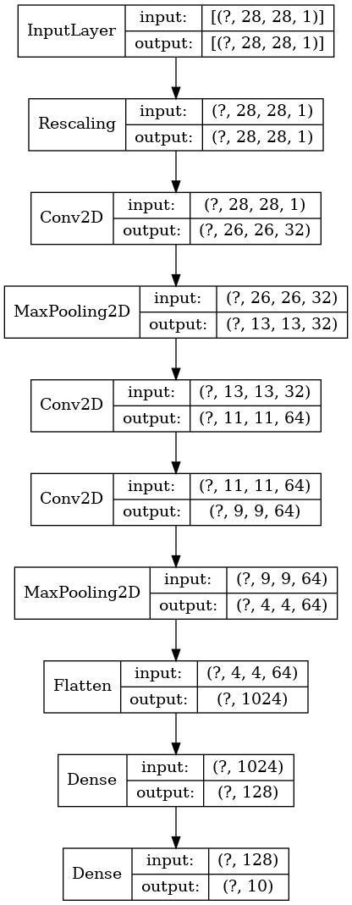

# Week 5
This assignment was created using:
* TensorFlow Version : 2.1.0
* Nvidia CUDA Version - 10.1
* Nvidia CUDNN Version - 10.1 
* MNIST Dataset - Handwritten Digits (Using keras.datasets)

## Convolution Neural Networks
In this week's project, we implement a Convolutional Neural Network from scratch to classify handwritten digits 0-9 using the MNIST open-source dataset which contains 60,000 training images with corresponding labels and 10,000 testing images. All images are of the size (28x28) and have only one color-channel. The model has been implemented using Keras and TensorFlow.
The CNN is created with the following Architecture:

After training the model, the performance metrics are as follows:
Training Accuracy = 99.96%
Testing Accuracy = 99.67%

### The following files are used:

* **Main.​py**
 The main file for the program, here we implement the CNN using Keras and TensorFlow. We first load the MNIST dataset from keras.datasets and then design the model and then compile and fit the CNN model using the training and testing images from the dataset. We then print the Training and Testing Accuracy
 
 * **model.​h5**
 This is the file we use to save and store the model after training so that it can be loaded and deployed for predictions.
 
 * **model.png**
Visual Representation of our CNN model using the *plot_model* function from tf.keras.utils 
 
 * **model_result.png** 
Screenshot of the Testing and Training Accuracy computed after completion of training the model with 200 epochs.
* **photo.jpg**

Photo we shall use to test the model with our own image and generate predictions.
* **Detector.​py**
 The file will load our CNN Classifier Model and then use it to generate predictions on the test image *photo.jpg*. The results are then stored in *predicted_results.jpg*
 * **predicted_results.jpg**

 This is the result of *Detector.​py* and is basically the test photo after highlighting the ROIs (Regions of Interests) and then generating predictions for each digit using the model.
